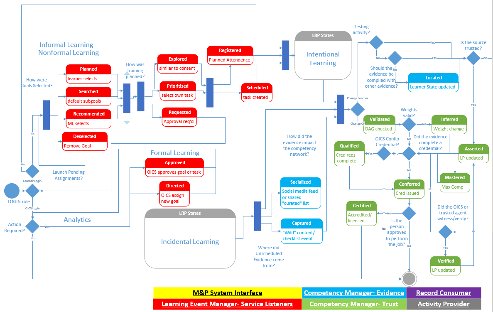
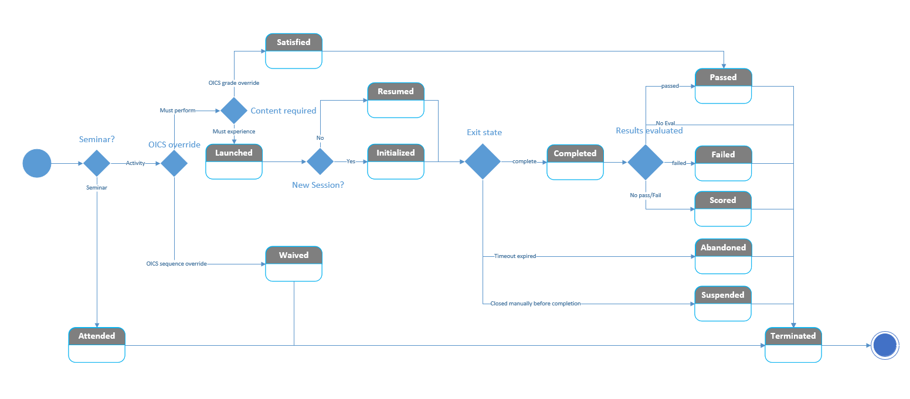

**2019 Report on the Total Learning Architecture – Appendix B**

P9274.3.2\_D1\_June2020

## **IEEE Draft Standard for Learning
 Technology—
 JavaScript Object Notation (JSON) Binding of Experience API (xAPI) Data for the Total Learning Architecture (TLA)**

Sponsor

**Learning Technology Standards Committee** of the **IEEE Computer Society**

Copyright © 2019 by The Institute of Electrical and Electronics Engineers, Inc.

Three Park Avenue

New York, New York 10016-5997, USA

All rights reserved.

This document reoresents an early **draft** of a proposed IEEE Standard and is intended to facilitate discussion, understanding, and improvements in how learner data is communicated between activities, devices, systems, platforms, and institutional boundaries. While this document follows the IEEE format for a specification, it has not been formally submitted into a standards working group. As such, this document is subject to change. USE AT YOUR OWN RISK!

IEEE copyright statements SHALL NOT BE REMOVED from draft or approved IEEE standards, or modified in any way. Because this is an unapproved draft, this document must not be utilized for any conformance/compliance purposes. Permission is hereby granted for officers from each IEEE Standards Working Group or Committee to reproduce the draft document developed by that Working Group for purposes of international standardization consideration. IEEE Standards Department must be informed of the submission for consideration prior to any reproduction for international standardization consideration ([stds.ipr@ieee.org](mailto:stds.ipr@ieee.org)). Prior to adoption of this document, in whole or in part, by another standards development organization, permission must first be obtained from the IEEE Standards Department ([stds.ipr@ieee.org](mailto:stds.ipr@ieee.org)). When requesting permission, IEEE Standards Department will require a copy of the standard development organization&#39;s document highlighting the use of IEEE content. Other entities seeking permission to reproduce this document, in whole or in part, must also obtain permission from the IEEE Standards Department.

IEEE Standards Department

445 Hoes Lane

Piscataway, NJ 08854, USA

**Abstract**: This Standard defines a controlled vocabulary and key processes to be followed when communicating learner data between activities, content, devices, systems, platforms, and organizational/institutional boundaries. It utilizes the IEEE Standard xAPI (9274.1.1) and the associated xAPI Profile standard (9274.3.1) to define how components of the Total Learning Architecture (TLA) communicate, store, and propagate learning information between computational and data assets located throughout the Future Learning Ecosystem. It provides a JSON binding of such data that is also conformant to the IEEE xAPI Profile Standard.

**Keywords**: 9274.1.1, 9274.3.1, JavaScript Object Notation, JSON, Experience API, xAPI, Total Learning Architecture, TLA, Profile, xAPI Profile

**Important Notices and Disclaimers Concerning IEEE Standards Documents**
IEEE documents are made available for use subject to important notices and legal disclaimers. These notices and disclaimers, or a reference to this page, appear in all standards and may be found under the heading &quot;Important Notices and Disclaimers Concerning IEEE Standards Documents.&quot; They can also be obtained on request from IEEE or viewed at [https://standards.ieee.org/IPR/disclaimers.html](http://standards.ieee.org/IPR/disclaimers.html).

**Notice and Disclaimer of Liability Concerning the Use of IEEE Standards Documents**
IEEE Standards documents (standards, recommended practices, and guides), both full-use and trial-use, are developed within IEEE Societies and the Standards Coordinating Committees of the IEEE Standards Association (&quot;IEEE-SA&quot;) Standards Board. IEEE (&quot;the Institute&quot;) develops its standards through a consensus development process, approved by the American National Standards Institute (&quot;ANSI&quot;), which brings together volunteers representing varied viewpoints and interests to achieve the final product. IEEEStandards are documents developed through scientific, academic, and industry-based technical working groups. Volunteers in IEEE working groups are not necessarily members of the Institute and participate without compensation from IEEE. While IEEE administers the process and establishes rules to promote fairness in the consensus development process, IEEE does not independently evaluate, test, or verify the accuracy of any of the information or the soundness of any judgments contained in its standards.

IEEE Standards do not guarantee or ensure safety, security, health, or environmental protection, or ensure against interference with or from other devices or networks. Implementers and users of IEEE Standards documents are responsible for determining and complying with all appropriate safety, security, environmental, health, and interference protection practices and all applicable laws and regulations.

IEEE does not warrant or represent the accuracy or content of the material contained in its standards, and expressly disclaims all warranties (express, implied and statutory) not included in this or any other document relating to the standard, including, but not limited to, the warranties of: merchantability; fitness for a particular purpose; non-infringement; and quality, accuracy, effectiveness, currency, or completeness of material. In addition, IEEE disclaims any and all conditions relating to: results; and workmanlike effort. IEEE standards documents are supplied &quot;AS IS&quot; and &quot;WITH ALL FAULTS.&quot;

Use of an IEEE standard is wholly voluntary. The existence of an IEEE standard does not imply that there are no other ways to produce, test, measure, purchase, market, or provide other goods and services related to the scope of the IEEE standard. Furthermore, the viewpoint expressed at the time a standard is approved and issued is subject to change brought about through developments in the state of the art and comments received from users of the standard.

In publishing and making its standards available, IEEE is not suggesting or rendering professional or other services for, or on behalf of, any person or entity nor is IEEE undertaking to perform any duty owed by any other person or entity to another. Any person utilizing any IEEE Standards document, should rely upon his or her own independent judgment in the exercise of reasonable care in any given circumstances or, as appropriate, seek the advice of a competent professional in determining the appropriateness of a given IEEE standard.

IN NO EVENT SHALL IEEE BE LIABLE FOR ANY DIRECT, INDIRECT, INCIDENTAL, SPECIAL, EXEMPLARY, OR CONSEQUENTIAL DAMAGES (INCLUDING, BUT NOT LIMITED TO: PROCUREMENT OF SUBSTITUTE GOODS OR SERVICES; LOSS OF USE, DATA, OR PROFITS; OR BUSINESS INTERRUPTION) HOWEVER CAUSED AND ON ANY THEORY OF LIABILITY, WHETHER IN CONTRACT, STRICT LIABILITY, OR TORT (INCLUDING NEGLIGENCE OR OTHERWISE) ARISING IN ANY WAY OUT OF THE PUBLICATION, USE OF, OR RELIANCE UPON ANY STANDARD, EVEN IF ADVISED OF THE POSSIBILITY OF SUCH DAMAGE AND REGARDLESS OF WHETHER SUCH DAMAGE WAS FORESEEABLE.

**Translations**
The IEEE consensus development process involves the review of documents in English only. If an IEEE standard is translated, only the English version published by IEEE should be considered the approved IEEE standard.

**Official statements**
A statement, written or oral, that is not processed in accordance with the IEEE-SA Standards Board Operations Manual shall not be considered or inferred to be the official position of IEEE or any of its committees and shall not be considered to be, or be relied upon as, a formal position of IEEE. At lectures, symposia, seminars, or educational courses, an individual presenting information on IEEE standards shall make it clear that his or her views should be considered the personal views of that individual rather than the formal position of IEEE.

**Comments on standards**
Comments for revision of IEEE Standards documents are welcome from any interested party, regardless of membership affiliation with IEEE. However, IEEE does not provide consulting information or advice pertaining to IEEE Standards documents. Suggestions for changes in documents should be in the form of a proposed change of text, together with appropriate supporting comments. Since IEEE standards represent a consensus of concerned interests, it is important that any responses to comments and questions also receive the concurrence of a balance of interests. For this reason, IEEE and the members of its societies and Standards Coordinating Committees are not able to provide an instant response to comments or questions except in those cases where the matter has previously been addressed. For the same reason, IEEE does not respond to interpretation requests. Any person who would like to participate in revisions to an IEEE standard is welcome to join the relevant IEEE working group.

Comments on standards should be submitted to the following address:

Secretary, IEEE **-** SA Standards Board

445 Hoes Lane

Piscataway, NJ 08854 USA

**Laws and regulations**
Users of IEEE Standards documents should consult all applicable laws and regulations. Compliance with the provisions of any IEEE Standards document does not imply compliance to any applicable regulatory requirements. Implementers of the standard are responsible for observing or referring to the applicable regulatory requirements. IEEE does not, by the publication of its standards, intend to urge action that is not in compliance with applicable laws, and these documents may not be construed as doing so.

**Copyrights**
IEEE draft and approved standards are copyrighted by IEEE under U.S. and international copyright laws. They are made available by IEEE and are adopted for a wide variety of both public and private uses. These include both uses, by reference, in laws and regulations, and use in private self-regulation, standardization, and the promotion of engineering practices and methods. By making these documents available for use and adoption by public authorities and private users, IEEE does not waive any rights in copyright to the documents.

**Photocopies**
Subject to payment of the appropriate fee, IEEE will grant users a limited, non-exclusive license to photocopy portions of any individual standard for company or organizational internal use or individual, non-commercial use only. To arrange for payment of licensing fees, please contact Copyright Clearance Center, Customer Service, 222 Rosewood Drive, Danvers, MA 01923 USA; +1 978 750 8400. Permission to photocopy portions of any individual standard for educational classroom use can also be obtained through the Copyright Clearance Center.

**Updating of IEEE Standards documents**
Users of IEEE Standards documents should be aware that these documents may be superseded at any time by the issuance of new editions or may be amended from time to time through the issuance of amendments, corrigenda, or errata. A current IEEE document at any point in time consists of the current edition of the document together with any amendments, corrigenda, or errata then in effect.

Every IEEE standard is subjected to review at least every ten years.When a document is more than ten years old and has not undergone a revision process, it is reasonable to conclude that its contents, although still of some value, do not wholly reflect the present state of the art. Users are cautioned to check to determine that they have the latest edition of any IEEE standard.

In order to determine whether a given document is the current edition and whether it has been amended through the issuance of amendments, corrigenda, or errata, visit IEEE Xplore at [https://ieeexplore.ieee.org/](http://ieeexplore.ieee.org/) or contact IEEE at the address listed previously. For more information about the IEEE-SA or IEEE&#39;s standards development process, visit the IEEE-SA Website at [https://standards.ieee.org](http://standards.ieee.org/).

**Errata**
Errata, if any, for all IEEE standards can be accessed on the IEEE-SA Website at the following URL:[https://standards.ieee.org/findstds/errata/index.html](http://standards.ieee.org/findstds/errata/index.html). Users are encouraged to check this URL for errata periodically.

**Patents**
Attention is called to the possibility that implementation of this standard may require use of subject matter covered by patent rights. By publication of this standard, no position is taken by the IEEE with respect to the existence or validity of any patent rights in connection therewith. If a patent holder or patent applicant has filed a statement of assurance via an Accepted Letter of Assurance, then the statement is listed on the IEEE-SA Website at [https://standards.ieee.org/about/sasb/patcom/patents.html](http://standards.ieee.org/about/sasb/patcom/patents.html). Letters of Assurance may indicate whether the Submitter is willing or unwilling to grant licenses under patent rights without compensation or under reasonable rates, with reasonable terms and conditions that are demonstrably free of any unfair discrimination to applicants desiring to obtain such licenses.

Essential Patent Claims may exist for which a Letter of Assurance has not been received. The IEEE is not responsible for identifying Essential Patent Claims for which a license may be required, for conducting inquiries into the legal validity or scope of Patents Claims, or determining whether any licensing terms or conditions provided in connection with submission of a Letter of Assurance, if any, or in any licensing agreements are reasonable or non-discriminatory. Users of this standard are expressly advised that determination of the validity of any patent rights, and the risk of infringement of such rights, is entirely their own responsibility. Further information may be obtained from the IEEE Standards Association.

**\_\_\_\_\_\_\_\_\_\_\_\_\_\_\_\_\_\_\_**

The Institute of Electrical and Electronics Engineers, Inc.
Three Park Avenue, New York, NY 10016-5997, USA
Copyright © 2005 by the Institute of Electrical and Electronics Engineers, Inc.
All rights reserved. Published 2019. Printed in the United States of America.

# Participants
At the time this Standard was completed, the JavaScript Object Notation (JSON) Binding of Experience API (xAPI) Data for the Total Learning Architecture (TLA) Working Group had the following membership:

| TBD, _Chair_
Jerry Gordon, Andy Johnson and Florian Tolk, _Technical Editors_ |

The following individual members of the balloting committee voted on this Standard. Balloters may have voted for approval, disapproval, or abstention. \

Also included are the following nonvoting IEEE–SA Standards Board liaisons:

# Introduction
(This introduction is not part of IEEE Std 9274.3.2, _JavaScript Object Notation (JSON) Binding of Experience API (xAPI) Data for the Total Learning Architecture (TLA)._

This Standard defines a set of controlled vocabulary and processes to be followed when the IEEE Standard xAPI (9274.1.1) is used in an environment categorized as conformant to the Total Learning Architecture. It provides a JSON binding of such data that is also conformant to the IEEE xAPI Profile Standard (9274.3.1). This standard defines the structure and constraints of JSON data in this environment.

The purpose of this Standard is to allow the creation of semantically interoperable instances of learning data services exchanging xAPI across learning environments that adopt the TLA. This Standard uses a JSON encoding that is also conformant to the xAPI and xAPI Profile standards, which allows for interoperability and the exchange of xAPI data between all components of the TLA.

# Contents
 - [Overview](./MOM_Spec.md#Overview)
 - Scope
 - Purpose
 - Word usage
 - Normative references
 - Definitions, acronyms, and abbreviations
 - Definitions
 - Acronyms and abbreviations
 - Conformance
 - TLA conformance level
 - TLA conformance level
 - TLA conformance level
 - TLA conformance level
 - TLA conformance level
 - TLA xAPI JSON-binding definition
 - Statement data requirements
      - Completed
 - Passed
 - Failed
 - Satisfied
 - Abandoned
 - Terminated
 - Initialized
 - Recommended
 - Prioritized
 - Organized
 - Projected
 - Planned
 - Deselected
 - Requested
 - Approved
 - Augmented
 - Explored
 - Clarified
 - Directed
 - Scheduled
 - Evaluated
 - Tracked
 - Surveyed
 - Assessed
 - Contextualized
 - Located
 - Socialized
 - Captured
 - Asserted
 - Validated
 - Inferred
 - Qualified
 - Certified
 - Verified
 - Conferred
 - Recruited
 - Appraised
 - Detailed
 - Mobilized
 - Employed
 - Schooled
 - Promoted
 - Screened
 - Selected
 - Transitioned
 - Released
 - Restricted
 - LRS storage requirements
 - TLA environment reporting requirements
 - Competency management function
 - Learning event management function
 - Activity provider function
 - Human capital management function
 - Annex A40
 - Annex B41
 - Annex C44
 - Annex D46
 - Annex E47

## IEEE Standard for Learning
 Technology—
 JavaScript Object Notation (JSON) Binding of Experience API (xAPI) Data for the Total Learning Architecture (TLA)

# Overview
The scope and purpose of this Standard are discussed in 1.1 and 1.2.

## Scope
This Standard defines a set of controlled vocabulary and processes to be followed when the IEEE Standard xAPI (9274.1.1) is used in an environment categorized as conformant to the Total Learning Architecture. It provides a JSON binding of such data that is also conformant to the IEEE xAPI Profile Standard (9274.3.1). This standard defines the structure and constraints of JSON data in this environment. This standard may be used as an xAPI profile in that elements of this standard may be extracted and used in other profiles, or independent of a TLA-conformant technology.

## Purpose
The purpose of this Standard is to allow the creation of interoperable xAPI instances across learning environments that adopt the TLA. This Standard uses a JSON encoding that is also conformant to the xAPI and xAPI Profile standards, which allows for interoperability and the exchange of xAPI data between all components of the TLA.

## Word usage
The word _shall_ indicates mandatory requirements strictly to befollowed in order to conform to the standard and from which no deviation is permitted (shall equals is required to). [[1]](#foot-1) [[2]](#foot-2)

The word _should_ indicates that among several possibilities one isrecommended as particularly suitable, without mentioning or excludingothers; or that a certain course of action is preferred but notnecessarily required (should equals is recommended that).

The word _may_ is used to indicate a course of action permissible withinthe limits of the standard (may equals is permitted to).

The word _can_ is used for statements of possibility and capability,whether material, physical, or causal (can equals is able to).

# Normative references

The following referenced documents are indispensable for the application of this Standard. For dated references, only the edition cited applies. For undated references, the latest edition of the referenced document (including any amendments or corrigenda) applies.

IEEE Std 9274.1.1, Experience API (xAPI) Standard. [[3]](#foot-3)

IEEE Std 9274.3.1, Experience API (xAPI) Profile Standard. [[4]](#foot-4)

Cmi5 Specification [[5]](#foot-5)

RFC 8256: The JavaScript Object Notation (JSON) Data Interchange Format [[6]](#foot-6)

# Definitions, acronyms, and abbreviations

Definitions and acronyms are defined in 3.1 and 3.2, respectively.

## Definitions

For the purposes of this Standard, the following terms and definitions apply _The Authoritative Dictionary of IEEE Standards Terms_ [[7]](#foot-7)
 should be referenced for

terms not defined in this clause.

**actor** : An individual, organization, technology, or other provider of data within a learning experience or acting within the TLA. In an xAPI statement, the &quot;doer&quot; of the statement.

**authoritative LRS:** A classification of LRS that stores a record of learner proficiency that is aligned with an individual&#39;s associated competency frameworks. It has the purpose of disallowing certain persons access to certain types of data. Only an Observer, Instructor, Controller, Supervisor (OICS) can access an authoritative LRS. The Authoritative LRS stores digitally signed xAPI records of conferred credentials and other competency assertions.

**competency:** Formally defined, organized, and structured description of knowledge, skills, attributes, and other characteristics that can be used to manage human capital. Each competency can have a wide range of associated metadata (e.g. description, type, scope, level, and context) and associated resources (e.g. assessments, operations manuals, and training content).

**competency framework:** A data model for describing, referencing, and sharing competency definitions, primarily in the context of learning and development. It provides a formal representation of the key characteristics of a competency, independently of its use in any particular context. It enables interoperability among learning systems that deal with competency information by providing a means for them to refer to common definitions with common meanings.

**Experience API (xAPI):** An IEEE Standard (9274.1.1) that establishes data formats and protocols for learning experience data. Most of the requirements around creation, storage, and retrieval of JSON data.

**JavaScript Object Notation (JSON):** A format of JavaScript that has specific structure and properties. These include use of structured name/value pairs and an ordered list of values.

**Learning Record Provider (LRP):** A system/service that creates xAPI data and sends it to an LRS. An LRP is responsible for the quality and structure of xAPI data.

**Learning Record Store (LRS):** The basic storage and retrieval web service, often implemented as a system, for xAPI data.

**Master Object Model (MOM):** The TLA policy framework includes a Master Object Model (TLA MOM) that specifies event triggers between TLA core components. The TLA MOM is an xAPI profile that defines the activity streams that create the events to manage TLA federation execution.

**noisy LRS -** An LRS without additional data restrictions seen in an Authoritative LRS. This LRS is typically associated with a specific learning activity, device, or system and is used to house all xAPI statements generated by that system. These statements are used to drive additional interventions or functionality within that system but only the TLA MOM verbs are communicated to other TLA components or activities.

**Observer/Instructor/Controller/Supervisor (OICS):** An actor with increased permission to access learner data. The only allowable user of an authoritative LRS.

**profile:** Additional rules to be applied from a base specification. This document is a profile of xAPI, meaning that in order to be conformant to the profile, the technology shall also be conformant to xAPI.

**statement:** A basic unit of learning experience data as defined in the xAPI standard. A statement is formatted using JSON and has among its properties, actor, verb, and object.

**Total Learning Architecture (TLA):** A research and development activity sponsored by the ADL Initiative and conducted in collaboration with stakeholders from across the defense community, professional standards organizations, and commercial industry. The TLA project will result in a collection of policy, specifications (including this document), and standards for connecting &quot;any device, anywhere, any time&quot; to generate learning-related data enabling next-generation learning that is integrated, personalized, and data-driven.

**transactional LRS:** An LRS without additional data restrictions seen in an authoritative LRS. While the noisy LRS collects all xAPI statements, the transactional LRS only collects learner data that is conformant to the TLA Meta Object Model (MOM). This allows learner performance information to be normalized as it is processed by a Competency Management System. A transactional LRS is trusted within TLA.

**verb:** The most defining property in an xAPI statement – the &quot;action&quot; of the statement. A verb is an IRI, often shortened when being described, that uniquely identifies a tracked interaction.

## Acronyms and abbreviations
JSON – JavaScript Object Notation

LPR: Learning Record Provider

LRS: Learning Record Store

OICS: Observer/Instructor/Controller/Supervisor

TLA: Total Learning Architecture

xAPI: Experience API

# Conformance
Conformance to this Standard is discussed in 4.1 through 4.5. Please see Section 1.3, Word Usage, to determine the nature of requirements found in this section. The TLA proscribes multiple levels of conformance. There are requirements for conformance that are both in scope and out of scope of this document. The requirements for xAPI data are listed in 4.1 through 4.5. It is expected that all TLA systems (LRS, LRP, etc.) follow the requirements appropriate to their function in a TLA environment.

## TLA conformance level 1
An instance of TLA level 1

- Shall conform to the xAPI Standard
- Shall conform to the xAPI Profile Standard
- Should conform to the cmi5 Specification (in regard to xAPI statements)
- Shall implement general requirements as found in 5.1
- Shall implement statements using the &quot;certified&quot; verb with all requirements fulfilled from 5.1.36
- Should implement statements using the &quot;completed&quot; verb. If implemented, shall be done so with all requirements fulfilled from 5.1.3
- Should implement statements using the &quot;passed&quot; verb. If implemented, shall be done so with all requirements fulfilled from 5.1.4
- Should implement statements using the &quot;failed&quot; verb. If implemented, shall be done so with all requirements fulfilled from 5.1.5
- Shall implement statements using the &quot;success&quot; result in at least one of statements that use the &quot;completed&quot;, &quot;passed&quot;, or &quot;failed&quot; verbs.
- May implement statements with verbs found in section 5.1. If implemented, shall be done so with all requirements fulfilled from corresponding section in 5.1
- May implement statements with verbs not found in this specification
- Shall send statements to their appropriate LRS as defined in 5.2
- Should generate statements in appropriate systems as defined in 5.3

## TLA conformance level 2
An instance of TLA level 2

- Shall follow requirements of all TLA level 1
- Shall conform to the cmi5 Specification (in regard to xAPI statements)
- Shall implement statements using the &quot;completed&quot; verb with all requirements fulfilled from 5.1.3
- Shall implement statements using the &quot;passed&quot; verb with all requirements fulfilled from 5.1.4.
- Shall implement statements using the &quot;passed&quot; verb using the &quot;success&quot; result property if the object type is &quot;assessment&quot;
- Shall implement statements using the &quot;failed&quot; verb with all requirements fulfilled from 5.1.5.
- Shall implement statements using the &quot;failed&quot; verb using the &quot;success&quot; result property if the object type is &quot;assessment&quot;
- Shall implement statements using the &quot;launched&quot; verb with all requirements fulfilled from 5.1.2
- Shall implement statements using the &quot;initialized&quot; verb with all requirements fulfilled from 5.1.9
- Shall implement statements using the &quot;waived&quot; verb with all requirements fulfilled from 5.1.1
- Shall implement statements using the &quot;satisfied&quot; verb with all requirements fulfilled from 5.1.6
- Shall implement statements using the &quot;abandoned&quot; verb with all requirements fulfilled from 5.1.7
- Shall implement statements using the &quot;terminated&quot; verb with all requirements fulfilled from 5.1.8

## TLA conformance level 3
An instance of TLA level 3

- Shall follow requirements of all TLA level 1-2
- Shall implement authority in xAPI statements that use verbs that require an authoritative source, as defined in 5.1.
- Shall implement statements using the &quot;assessed&quot; verb with all requirements fulfilled from 5.1.26
- Shall implement statements using the &quot;contextualized&quot; verb with all requirements fulfilled from 5.1.27
- Shall implement statements using the &quot;located&quot; verb with all requirements fulfilled from 5.1.28
- Shall implement statements using the &quot;socialized&quot; verb with all requirements fulfilled from 5.1.29
- Shall implement statements using the &quot;captured&quot; verb with all requirements fulfilled from 5.1.30
- Shall implement statements using the &quot;asserted&quot; verb with all requirements fulfilled from 5.1.31
- Shall implement statements using the &quot;validated&quot; verb with all requirements fulfilled from 5.1.32
- Shall implement statements using the &quot;inferred&quot; verb with all requirements fulfilled from 5.1.33
- Shall implement statements using the &quot;qualified&quot; verb with all requirements fulfilled from 5.1.34
- Shall implement statements using the &quot;certified&quot; verb with all requirements fulfilled from 5.1.35
- Shall implement statements using the &quot;verified&quot; verb with all requirements fulfilled from 5.1.36
- Shall implement statements using the &quot;conferred&quot; verb with all requirements fulfilled from 5.1.37

## TLA conformance level 4
An instance of TLA level 4

- Shall follow requirements of all TLA level 1-3
- Shall implement statements using the &quot;organized&quot; verb with all requirements fulfilled from 5.1.11
- Shall implement statements using the &quot;prioritized&quot; verb with all requirements fulfilled from 5.1.12
- Shall implement statements using the &quot;curated&quot; verb with all requirements fulfilled from 5.1.13
- Shall implement statements using the &quot;projected&quot; verb with all requirements fulfilled from 5.1.14
- Shall implement statements using the &quot;recommended&quot; verb with all requirements fulfilled from 5.1.10
- Shall implement statements using the &quot;planned&quot; verb with all requirements fulfilled from 5.1.15
- Shall implement statements using the &quot;deselected&quot; verb with all requirements fulfilled from 5.1.16
- Shall implement statements using the &quot;requested&quot; verb with all requirements fulfilled from 5.1.17
- Shall implement statements using the &quot;approved&quot; verb with all requirements fulfilled from 5.1.18
- Shall implement statements using the &quot;augmented&quot; verb with all requirements fulfilled from 5.1.19
- Shall implement statements using the &quot;explored&quot; verb with all requirements fulfilled from 5.1.20
- Shall implement statements using the &quot;clarified&quot; verb with all requirements fulfilled from 5.1.21
- Shall implement statements using the &quot;directed&quot; verb with all requirements fulfilled from 5.1.22
- Shall implement statements using the &quot;scheduled&quot; verb with all requirements fulfilled from 5.1.23
- Shall implement statements using the &quot;evaluated&quot; verb with all requirements fulfilled from 5.1.24
- Shall implement statements using the &quot;tracked&quot; verb with all requirements fulfilled from 5.1.25
- Shall implement statements using the &quot;surveyed&quot; verb with all requirements fulfilled from 5.1.26

## TLA conformance level 5
An instance of TLA level 5

- Shall follow requirements of all TLA level 1-4
- Shall implement statements using the &quot;recruited&quot; verb with all requirements fulfilled from 5.1.38
- Shall implement statements using the &quot;appraised&quot; verb with all requirements fulfilled from 5.1.39
- Shall implement statements using the &quot;detailed&quot; verb with all requirements fulfilled from 5.1.40
- Shall implement statements using the &quot;mobilized&quot; verb with all requirements fulfilled from 5.1.41
- Shall implement statements using the &quot;employed&quot; verb with all requirements fulfilled from 5.1.42
- Shall implement statements using the &quot;schooled&quot; verb with all requirements fulfilled from 5.1.43
- Shall implement statements using the &quot;promoted&quot; verb with all requirements fulfilled from 5.1.44
- Shall implement statements using the &quot;screened&quot; verb with all requirements fulfilled from 5.1.45
- Shall implement statements using the &quot;selected&quot; verb with all requirements fulfilled from 5.1.46
- Shall implement statements using the &quot;transitioned&quot; verb with all requirements fulfilled from 5.1.47
- Shall implement statements using the &quot;released&quot; verb with all requirements fulfilled from 5.1.48
- Shall implement statements using the &quot;restricted&quot; verb with all requirements fulfilled from 5.1.49

# TLA xAPI JSON-binding definition
A TLA solution is &quot;learner-centric&quot;. This means all learner activity should be retrievable from any LRS (e.g. even those with minimally conformant behavior) through querying mechanism in the xAPI standard. This standard describes the reporting portion of a TLA solution, which decentralizing state management within the systems. Most of this management is done through use of xAPI statements. Any TLA data reporting that is not xAPI is beyond the scope of this specification. 5.1-5.3 describe the data requirements of xAPI statements within the TLA. A comprehensive description of use of TLA data can be found in Annex E.

## Statement data requirements
This section describes requirements for xAPI statements within the TLA. An xAPI statement has an actor, verb, and object, and other properties. A statement is from an authoritative source if and only if the authority property is traceable back to the statement provider.

- xAPI statements shall be conformant to the xAPI Standard
- xAPI statements using verbs in this document shall implement properties as described (see Note below) in the templates in 5.1.1-5.1.49
- xAPI statements using verbs in this document may implement properties that are not represented in the templates in 5.1.1-5.1.49
- xAPI statements shall be constructed such that the learner is represented by the actor, object, a specific context extension as represented by the templates in 5.1..1-5.1.49
- The actor in any xAPI statement shall be of objectType &quot;Agent&quot;
- The actor in any xAPI statement shall contain an &quot;account, even if the actor is not the learner&quot;

Each verb in an xAPI statement determines which template to follow, corresponding to a specific piece of learning evidence that is tracked. The naming convention of these verbs indicates an active model, where the actor is the &quot;doer&quot; of the verb. The learner is an integral part of every xAPI statement. When an xAPI statement is sent directly as a result of the learner&#39;s action, such as a user requesting to take a course, the actor of that statement is the learner. When something is happening to the learner as a result of another actor (instructor, system, etc.) the learner is represented in a context extension, such that the activity may remain in the object portion of the statement. The rationale for this design is to minimize the number of necessary extensions within this profile, instead relying on Activity types that the LRS can keep definitions of more easily. All other necessary requirements for xAPIs statement properties, in addition to those in the xAPI Standard, are listed in the xAPI Profile templates listed in 5.1.1-5.1.49. Among these properties are objects with type &quot;activity&quot;, which often represent the learning construct of the statement. More information about each type of object can be found in Annex D.

**Note:** Any property listed in a template with a specific value (including booleans) shall retain that value in a statement created that follows the template. In properties where there is not a specific value, these templates contain in capital letters requirements that shall be followed. These requirements are not &quot;shall&quot;, &quot;should&quot;, or &quot;shall not&quot;, but should be translated as such. The use of &quot;RECOMMENDED&quot; in the template indicates a &quot;should&quot; requirement. The use of &quot;EXCLUDED&quot; in the template indicates a &quot;shall not&quot; requirement. The use of &quot;REQUIRED&quot; in the template indicates a &quot;shall&quot; requirement. These requirements may be accompanied by explanatory text and/or other requirements on the data. Use of brackets indicates a choice of one or more of the elements within the bracket.

### Waived
>Verb:
>>id: "https://w3id.org/xapi/adl/verbs/waived",
>>display: "waived",
>>definition: "Indicates that the learning activity requirements were met by means other than completing the activity. A waived statement is used to indicate that the activity may be skipped by the actor."
>
>Object:
>>id: "",
>>objectType: Activity
>>definition:
>>>type:
>>>>["https://w3id.org/xapi/tla/activity-types/activity",
>>>>"https://w3id.org/xapi/tla/activity-types/assessment",
>>>>"https://w3id.org/xapi/tla/activity-types/competency"]

### Launched
>Verb:
>>id: "https://adlnet.gov/expapi/verbs/launched",
>>display: "launched",
>>definition: "Indicates the user started a service. This does not always need to be a specific activity but can be a service provider as well."
>
>Object:
>>id: "",
>>objectType: Activity
>>definition:
>>>type:
>>>>["https://w3id.org/xapi/tla/activity-types/activity",
>>>>"https://w3id.org/xapi/tla/activity-types/assessment",
>>>>"https://w3id.org/xapi/tla/activity-types/competency"]
>
>Context:
>>Context Activities: EXCLUDED

### Completed
>Verb:
>>id: "https://adlnet.gov/expapi/verbs/completed",
>>display: "completed",
>>definition: "Indicates the actor finished or concluded the activity normally"
>
>Object:
>>id: "",
>>objectType: Activity
>>definition:
>>>type:
>>>>["https://w3id.org/xapi/tla/activity-types/activity",
>>>>"https://w3id.org/xapi/tla/activity-types/assessment"]
>
>Result:
>>Success: RECOMMENDED
>>Duration: RECOMMENDED

### Passed

>Verb:
>>id: "https://adlnet.gov/expapi/verbs/passed",
>>display: "passed",
>>definition: "Indicates the actor completed an activity to standard"
>
>Object:
>>id: "",
>>objectType: Activity
>>definition:
>>>type: "https://w3id.org/xapi/tla/activity-types/assessment"
>
>Result:
>>Score:
>>>Scaled: RECOMMENDED
>>>Success: TRUE
>>>Completion: TRUE

### Failed
>Verb:
>>id: "https://adlnet.gov/expapi/verbs/failed",
>>display: "failed",
>>definition: "Indicates the actor did not complete an activity to standard"
>
>Object:
>>id: "",
>>objectType: Activity
>>definition:
>>>type: "https://w3id.org/xapi/tla/activity-types/assessment"
>
>Result:
>>Score:
>>>Scaled: RECOMMENDED
>>>Success: FALSE
>>>Completion: TRUE
### Satisfied
>Verb:
>>id: "https://w3id.org/xapi/adl/verbs/satisfied",
>>display: "satisfied",
>>definition: "Indicates that the authority or activity provider determined the actor has fulfilled the criteria of the object or activity by means other than completing the activity"
>
>Object:
>>id: "",
>>objectType: Activity
>>definition:
>>>type:
>>>>["https://w3id.org/xapi/tla/activity-types/activity",
>>>>"https://w3id.org/xapi/tla/activity-types/assessment"]

### Abandoned
>Verb:
>>id: "https://w3id.org/xapi/adl/verbs/abandoned",
>>display: "abandoned",
>>definition: "Indicates that the AU session was abnormally terminated by a learner's action (or due to a system failure)"
>
>Object:
>>id: "",
>>objectType: Activity
>>definition:
>>>type:
>>>>["https://w3id.org/xapi/tla/activity-types/activity",
>>>>"https://w3id.org/xapi/tla/activity-types/assessment"]
>
>Result:
>>Duration: RECOMMENDED
>>>_The duration property should, at a minimum, be set as the total session time, calculated as the time between the "launched" statement and the last statement (of any kind) issued by the exercise. Implementers should also use other (software specific) methods (if available) to determine if the total session time was longer._
>>
>>Completion: FALSE

### Terminated
>Verb:
>>id: "https://adlnet.gov/expapi/verbs/terminated",
>>display: "terminated",
>>definition: "Indicates the actor has completed their session normally"
>
>Object:
>>id: "",
>>objectType: Activity
>>definition:
>>>type:
>>>>["https://w3id.org/xapi/tla/activity-types/activity",
>>>>"https://w3id.org/xapi/tla/activity-types/assessment"]
>
>Result:
>>Duration: RECOMMENDED
>>>_The duration property should, at a minimum, be set as the total session time, calculated as the time between the &#39;launched&#39; statement and the last statement (of any kind) issued by the exercise. Implementers should also use other (software specific) methods (if available) to determine if the total session time was longer._
>>
>>Completion: FALSE

### Initialized
>Verb:
>>id: "https://adlnet.gov/expapi/verbs/initialized",
>>display: "initialized",
>>definition: "Indicates that the activity was started."
>
>Object:
>>id: "",
>>objectType: Activity
>>definition:
>>>type:
>>>>["https://w3id.org/xapi/tla/activity-types/activity",
>>>>"https://w3id.org/xapi/tla/activity-types/assessment"]
>
>Result: EXCLUDED

### Recommended
>Verb:
>>id: "https://w3id.org/xapi/tla/verbs/recommended",
>>display: "recommended",
>>definition: "Indicates the learner was given the recommendation to follow a career path, work towards a learning objective, or perform a learning activity by the actor"
>
>Object:
>>id: "",
>>objectType: INCLUDED
>>definition:
>>>type:
>>>>["https://w3id.org/xapi/tla/activity-types/activity_cluster",
>>>>"https://w3id.org/xapi/tla/activity-types/competency",
>>>>"https://w3id.org/xapi/tla/activity-types/assessment",
>>>>"https://w3id.org/xapi/tla/activity-types/activity",
>>>>"https://w3id.org/xapi/tla/activity-types/career",
>>>>"https://w3id.org/xapi/tla/activity-types/badge",
>>>>"https://w3id.org/xapi/tla/activity-types/job"]
>
>Result: EXCLUDED
>
>Context:
>>Extensions:
>>>"https://w3id.org/xapi/tla/extensions/learner": INCLUDED
>>>>_shall be the learner to whom this data applies to_

### Prioritized
>Verb:
>>id: "https://w3id.org/xapi/tla/verbs/prioritized",
>>display: "prioritized",
>>definition: "Indicates the actor filtered goals associated with select content, usually listing what competencies are demonstrated in recently viewed content"
>
>Object:
>>id: "",
>>definition:
>>>type:
>>>>["https://w3id.org/xapi/tla/activity-types/competency",
>>>>"https://w3id.org/xapi/tla/activity-types/career",
>>>>"https://w3id.org/xapi/tla/activity-types/badge",
>>>>"https://w3id.org/xapi/tla/activity-types/job"]
>
>Result: EXCLUDED
>>Context:
>>>Extensions:
>>>>"https://w3id.org/xapi/tla/extensions/evidence": INCLUDED
>>>>>_This will be an array of the activities that were used in the query_

### Organized
>Verb:
>>id: "https://w3id.org/xapi/tla/verbs/organized",
>>display: "organized",
>>definition: "Indicates the actor filtered content that aligns to specific goal"
>
>Object:
>>id: "",
>>objectType: INCLUDED
>>definition:
>>>type:
>>>>["https://w3id.org/xapi/tla/activity-types/activity_cluster",
>>>>"https://w3id.org/xapi/tla/activity-types/assessment",
>>>>"https://w3id.org/xapi/tla/activity-types/activity"]
>
>Result: EXCLUDED
>>Context:
>>>Extensions:
>>>>"https://w3id.org/xapi/tla/extensions/evidence": INCLUDED
>>>>>_This will be an array of the viewed/completed Competencies_

### Projected
>Verb:
>>id: "https://w3id.org/xapi/tla/verbs/projected",
>>display: "projected",
>>definition: "Indicates the actor was presented a list of goal recommendations over time, based on selected goal with recursive depth, what set of content can achieve mastery in the ordered sub-goals"
>
>Object:
>>id: "",
>>definition:
>>>type: RECOMMENDED
>
>Result:
>>Extensions:
>>>"https://w3id.org/xapi/tla/extensions/recommendation_order": INCLUDED
>>>>_This is an array of just activity recommendations statement references, in the order they were provided_

### Planned
>Verb:
>>id: "https://w3id.org/xapi/tla/verbs/planned",
>>display: "planned",
>>definition: "Indicates that the actor assigned themselves a new learning goal, without needing approval"
>
>Object:
>>id: "",
>>definition:
>>>type:
>>>>["https://w3id.org/xapi/tla/activity-types/competency",
>>>>"https://w3id.org/xapi/tla/activity-types/career",
>>>>"https://w3id.org/xapi/tla/activity-types/badge",
>>>>"https://w3id.org/xapi/tla/activity-types/job"]
>
>Result: EXCLUDED

### Deselected
>Verb:
>>id: "https://w3id.org/xapi/tla/verbs/deselected",
>>display: "deselected",
>>definition: "Indicates the actor removed specific goal or task"
>
>Object:
>>id: "",
>>definition:
>>>type:
>>>>["https://w3id.org/xapi/tla/activity-types/career",
>>>>"https://w3id.org/xapi/tla/activity-types/badge",
>>>>"https://w3id.org/xapi/tla/activity-types/credential",
>>>>"https://w3id.org/xapi/tla/activity-types/job_duty_gig",
>>>>"https://w3id.org/xapi/tla/activity-types/competency",
>>>>"https://w3id.org/xapi/tla/activity-types/activity"]
>
>Extensions:
>>"https://w3id.org/xapi/tla/extensions/instance": recommended
>>>_shall be a pointer to the instance of the goal within the learner profile_

### Requested
>Verb:
>>id: "https://w3id.org/xapi/adb/verbs/requested",
>>display: "requested",
>>definition: "Indicates the actor needed or demanded an object or another actor. Requested indicates a comment that is shared with peers as a group or Coach as a trainer. The request for coaching or help prompts users to respond giving them coaching credit"
>
>Object:
>>id: "",
>>definition:
>>>type:
>>>>["https://w3id.org/xapi/tla/activity-types/activity_cluster",
>>>>"https://w3id.org/xapi/tla/activity-types/assessment",
>>>>"https://w3id.org/xapi/tla/activity-types/activity"]
>
>Result: EXCLUDED

### Approved
>Verb:
>>id: "https://w3id.org/xapi/tla/verbs/approved",
>>display: "approved",
>>definition: "Indicates an OICS approved a requested activity for the given learner"
>
>Object:
>>id: "",
>>>_SHOULD be ID of "Requested" Statement being approved_
>>
>>definition:
>>>type:
>>>>["https://w3id.org/xapi/tla/activity-types/activity_cluster",
>>>>"https://w3id.org/xapi/tla/activity-types/assessment",
>>>>"https://w3id.org/xapi/tla/activity-types/activity"]
>
>Result: EXCLUDED
>
>Context:
>>Extensions:
>>>"https://w3id.org/xapi/tla/extensions/learner": INCLUDED
>>>>_shall be the learner to whom this data applies to_

### Augmented
>Verb:
>>id: "https://w3id.org/xapi/tla/verbs/augmented",
>>display: "augmented",
>>definition: "Indicates the actor searched content on an active learning goal, viewing what other goals/branches can be related based on an active goal tree"
>
>Object:
>>id: "",
>>definition:
>>>type:
>>>>["https://w3id.org/xapi/tla/activity-types/activity_cluster",
>>>>"https://w3id.org/xapi/tla/activity-types/assessment",
>>>>"https://w3id.org/xapi/tla/activity-types/activity"]
>
>Result: Excluded
>
>Context:
>>Extensions:
>>>"https://w3id.org/xapi/tla/extensions/evidence:: INCLUDED
>>>>_should be a resolvable identifier to the learning goal(s) used for this augmented event, but is open-ended to allow future mechanisms_

### Explored
>Verb:
>>id: "https://w3id.org/xapi/tla/verbs/explored",
>>display: "explored",
>>definition: "Indicates the actor searched active learning goals related to specific content, viewing what other content may trigger related goals, based on active goal and recently completed content"
>
>Object:
>>id: "",
>>definition:
>>>type:
>>>>["https://w3id.org/xapi/tla/activity-types/competency",
>>>>"https://w3id.org/xapi/tla/activity-types/career",
>>>>"https://w3id.org/xapi/tla/activity-types/badge",
>>>>"https://w3id.org/xapi/tla/activity-types/job"]
>
>Result: EXCLUDED
>>Context:
>>>Extensions:
>>>>"https://w3id.org/xapi/tla/extensions/evidence": INCLUDED
>>>>>_should be a resolvable identifier to the learning goal(s) used for this explored event, but is open-ended to allow future mechanisms_

### Clarified
>Verb:
>>id: "https://w3id.org/xapi/tla/verbs/clarified",
>>display: "clarified",
>>definition: "Indicates the actor queried what other content may also reinforce the current learning goal, after completing content"
>
>Object:
>>id: "",
>>definition:
>>>type:
>>>>["https://w3id.org/xapi/tla/activity-types/competency",
>>>>"https://w3id.org/xapi/tla/activity-types/career",
>>>>"https://w3id.org/xapi/tla/activity-types/badge",
>>>>"https://w3id.org/xapi/tla/activity-types/job"]
>
>Result: EXCLUDED
>
>Context:
>>Extensions:
>>>"https://w3id.org/xapi/tla/extensions/evidence": INCLUDED
>>>>_should be a resolvable identifier to the content and goal(s) used for this clarified event, but is open-ended to allow future mechanisms_

### Directed
>Verb:
>>id: "https://w3id.org/xapi/tla/verbs/directed",
>>display: "directed",
>>definition: "Indicates the actor was assigned a learning goal by another party"
>
>Object:
>>id: "",
>>definition:
>>>type:
>>>>["https://w3id.org/xapi/tla/activity-types/competency",
>>>>"https://w3id.org/xapi/tla/activity-types/career",
>>>>"https://w3id.org/xapi/tla/activity-types/badge",
>>>>"https://w3id.org/xapi/tla/activity-types/job"]
>
>Result: Excluded
>
>Context:
>>Extensions:
>>>"https://w3id.org/xapi/tla/extensions/learner": INCLUDED
>>>>_shall be the learner to whom this data applies to_

### Scheduled
>Verb:
>>id: "https://w3id.org/xapi/tla/verbs/scheduled",
>>display: "scheduled",
>>definition: "Indicates the actor scheduled an activity or lesson"
>
>Object:
>>id: "",
>>definition:
>>>type:
>>>>["https://w3id.org/xapi/tla/activity-types/activity_cluster",
>>>>"https://w3id.org/xapi/tla/activity-types/assessment",
>>>>"https://w3id.org/xapi/tla/activity-types/activity"]
>
>Result: Excluded
>
>Context:
>>Extensions:
>>>"https://w3id.org/xapi/tla/extensions/due_date": RECOMMENDED [[8]](#foot-8)
>>>>_shall be the date the object has to be completed_
>>>
>>>"https://w3id.org/xapi/tla/extensions/learner": INCLUDED
>>>>_shall be the learner to whom this data applies to_

### Evaluated
>Verb:
>>id: "https://w3id.org/xapi/tla/verbs/evaluated",
>>display: "evaluated",
>>definition: "Indicates the learner(s) appeared in a Measure of Effectiveness (MOE) search"
>
>Object
>>id: "",
>>definition:
>>>type:
>>>>["https://w3id.org/xapi/tla/activity-types/activity_cluster",
>>>>"https://w3id.org/xapi/tla/activity-types/assessment",
>>>>"https://w3id.org/xapi/tla/activity-types/activity"]
>
>Result: Excluded
>
>Context:
>>Extensions:
>>>"https://w3id.org/xapi/tla/extensions/learner": INCLUDED
>>>>_shall be the learner to whom this data applies to_

### Tracked
>Verb:
>>id: "https://w3id.org/xapi/tla/verbs/tracked",
>>display: "tracked",
>>definition: "Indicates the learner(s) appeared in a competency search"
>
>Object:
>>id: "",
>>definition:
>>>type: "https://w3id.org/xapi/tla/activity-types/competency"
>
>Result: Excluded
>
>Context:
>>Extensions:
>>>"https://w3id.org/xapi/tla/extensions/learner": INCLUDED
>>>>_shall be the learner to whom this data applies to_

### Surveyed
>Verb:
>>id: "https://w3id.org/xapi/tla/verbs/surveyed",
>>display: "surveyed",
>>definition: "Indicates the learner(s) appeared in a Measure of Performance (MOP) search"
>
>>Object:
>>id: "",
>>>_shall point to a node in the Competency Management System with type of MOP_
>>
>>definition:
>>>type:
>>>>["https://w3id.org/xapi/tla/activity-types/assessment",
>>>>"https://w3id.org/xapi/tla/activity-types/activity",
>>>>"https://w3id.org/xapi/tla/activity-types/career",
>>>>"https://w3id.org/xapi/tla/activity-types/badge",
>>>>"https://w3id.org/xapi/tla/activity-types/job"]
>
>Result: EXCLUDED
>
>Context:
>>Extensions:
>>>"https://w3id.org/xapi/tla/extensions/learner": INCLUDED
>>>>_shall be the learner to whom this data applies to_

### Assessed
>Verb:
>>id: "https://w3id.org/xapi/tla/verbs/assessed"
>>display: "assessed",
>>definition: "Indicates the actor completed assessments in a way that will cause a change in their authoritative learner state"
>
>Object:
>>id: "",
>>definition:
>>>type: "https://w3id.org/xapi/tla/activity-types/competency"
>
>Result:
>>Duration: RECOMMENDED
>>Completion: EXCLUDED
>>Score:
>>>Scaled: RECOMMENDED
>>>Success: INCLUDED
>
>Context:
>>Extensions:
>>>"https://w3id.org/xapi/tla/extensions/evidence": INCLUDED
>>>>_shall be a resolvable identifier to the xAPI statement(s) that resulted in this statement_
>>>
>>>"https://w3id.org/xapi/tla/extensions/confidence": INCLUDED
>>>>_shall be a number between -1 and 1 displaying how likely the learner is to have mastered the assessed competency, -1 being sure they have not, and 1 being certain they have_

### Contextualized
>Verb:
>>id: "https://w3id.org/xapi/tla/verbs/contextualized"
>>display: "contextualized",
>>definition: "Indicates the user performed several connected learning activities that should result in a change in their authoritative learner state"
>
>Object:
>>id: "",
>>definition:
>>>type: https://w3id.org/xapi/tla/activity-types/competency
>
>Context:
>>Extensions:
>>>"https://w3id.org/xapi/tla/extensions/evidence": INCLUDED
>>>>_shall be a resolvable identifier to the xAPI statement(s) that resulted in this statement_
>>>
>>>"https://w3id.org/xapi/tla/extensions/confidence": INCLUDED
>>>>_shall be a number between -1 and 1 displaying how likely the learner is to have mastered the assessed competency, -1 being sure they have not, and 1 being certain they have_

### Located
>Verb:
>>id: "https://w3id.org/xapi/tla/verbs/located"
>>display: "located",
>>definition: "Indicates the actor&#39;s competency state needs to be updated based on completed content changes in the Competency Framework"
>
>Object:
>>id: "",
>>definition:
>>>type: "https://w3id.org/xapi/tla/activity-types/competency"
>
>Result: EXCLUDED
>
>Context:
>>Extensions:
>>>"https://w3id.org/xapi/tla/extensions/evidence": INCLUDED
>>>>_shall be a resolvable identifier to the xAPI statement(s) that resulted in this statement_
>>>
>>>"https://w3id.org/xapi/tla/extensions/confidence": INCLUDED
>>>>_shall be a number between -1 and 1 displaying how likely the learner is to have mastered the located competency, -1 being sure they have not, and 1 being certain they have_

### Socialized
>Verb:
>>id: "https://w3id.org/xapi/tla/verbs/socialized",
>>display: "socialized",
>>definition: "Indicates the learner interacted with "Wild" (unscheduled) content in a social environment"
>
>Object
 >>   id: "",
>>definition:
>>>type:
>>>>["https://w3id.org/xapi/tla/activity-types/activity_cluster",
>>>>"https://w3id.org/xapi/tla/activity-types/assessment",
>>>>"https://w3id.org/xapi/tla/activity-types/activity"]
>
>Result: EXCLUDED

### Captured
>Verb:
>>id: "https://w3id.org/xapi/tla/verbs/captured",
>>display: "captured",
>>definition: "Indicates the learner interacted with "Wild" (unscheduled) content in a social environment"
>
>Object
>>id: "",
>>definition:
>>>type:
>>>>["https://w3id.org/xapi/tla/activity-types/activity_cluster",
>>>>"https://w3id.org/xapi/tla/activity-types/assessment",
>>>>"https://w3id.org/xapi/tla/activity-types/activity"]
>
>Result: EXCLUDED

### Asserted
>Verb:
>>id: "https://w3id.org/xapi/tla/verbs/asserted"
>>display: "asserted",
>>definition: "Indicates the learner has provided sufficient evidence to update the learner&#39;s measure of competence in a given competency"
>
>Object:
>>id: "",
>>definition:
>>>type: https://w3id.org/xapi/tla/activity-types/competency
>
>Result: EXCLUDED
>
>Context:
>>Extensions:
>>>"https://w3id.org/xapi/tla/extensions/evidence": INCLUDED
>>>>_shall be a resolvable identifier to the xAPI statement(s) that resulted in this statement_
>>>
>>>"https://w3id.org/xapi/tla/extensions/confidence": INCLUDED
>>>>_shall be a number between -1 and 1 displaying how likely the learner is to have mastered the competency, -1 being sure they have not, and 1 being certain they have_

### Validated
>Verb:
>>id: "https://w3id.org/xapi/tla/verbs/validated"
>>display: "validated",
>>definition: "Indicates an OICS approved a change to a competency framework within the TLA that will affect the learners&#39; states"
>
>Object:
>>id: "",
>>definition:
>>>type: https://w3id.org/xapi/tla/activity-types/competency
>
>Result: EXCLUDED
>
>Context:
>>Extensions:
>>>"https://w3id.org/xapi/tla/extensions/learner": INCLUDED
>>>>_shall be the learner to whom this data applies to_
>>>
>>>"https://w3id.org/xapi/tla/extensions/evidence": INCLUDED
>>>>_shall be a resolvable identifier to the xAPI asserted statement was just validated_
>>>
>>>"https://w3id.org/xapi/tla/extensions/confidence": INCLUDED
>>>>_shall be a number between -1 and 1 displaying how likely the learner is to have mastered the competency, -1 being sure they have not, and 1 being certain they have_

### Inferred
>Verb:
>>id: "https://w3id.org/xapi/tla/verbs/inferred"
>>display: "inferred",
>>definition: "Indicates an authoritative source changed a learner&#39;s competency assertions based on a valid competency framework change"
>
>Object:
>>id: "",
>>definition:
>>>type: https://w3id.org/xapi/tla/activity-types/competency
>
>Result: EXCLUDED
>
>Context:
>>Extensions:
>>>"https://w3id.org/xapi/tla/extensions/learner": INCLUDED
>>>>_shall be the learner to whom this data applies to_
>>>
>>>"https://w3id.org/xapi/tla/extensions/evidence": INCLUDED
>>>>_shall be a resolvable identifier to the xAPI statement(s) that resulted in this statement_
>>>
>>>"https://w3id.org/xapi/tla/extensions/confidence": INCLUDED
>>>>_shall be a number between -1 and 1 displaying how likely the learner is to have mastered the competency, -1 being sure they have not, and 1 being certain they have_

### Qualified
>Verb:
>>id: "https://w3id.org/xapi/tla/verbs/qualified"
>>display: "qualified",
>>definition: "Indicates the learner meets all the requirements for a badge, but hasn&#39;t been awarded the badge yet"
>
>Object:
>>id: "",
>>definition:
>>>type: https://w3id.org/xapi/tla/activity-types/badge
>
>Result: EXCLUDED
>
>Context:
>>Extensions:
>>>"https://w3id.org/xapi/tla/extensions/evidence": INCLUDED
>>>>_shall be a resolvable identifier to the xAPI statement(s) that resulted in this statement_

### Certified
>Verb:
>>id: "https://w3id.org/xapi/tla/verbs/certified"
>>display: "certified",
>>definition: "Indicates the learner received an accreditation by an authoritative source to perform a given job or task"
>
>Object:
>>id: "",
>>definition:
>>>type: "https://w3id.org/xapi/tla/activity-types/job"
>
>Result: EXCLUDED
>
>Context:
>>Extensions:
>>>"https://w3id.org/xapi/tla/extensions/evidence": INCLUDED
>>>>_shall be a resolvable identifier to the xAPI statement(s) that resulted in this statement_

### Verified
>Verb:
>>id: "https://w3id.org/xapi/tla/verbs/verified"
>>display: "verified",
>>definition: "Indicates the authoritative source verified evidence of learning from a non-authoritative source as reliable data"
>
>Object:
>>id: "",
>>definition:
>>>type: "https://w3id.org/xapi/tla/activity-types/competency"
>
>Result: EXCLUDED
>
>Context:
>>Extensions:
>>>"https://w3id.org/xapi/tla/extensions/evidence": INCLUDED
>>>>_shall be a resolvable identifier to the xAPI statement(s) that resulted in this statement_
>>>
>>>"https://w3id.org/xapi/tla/extensions/confidence": INCLUDED
>>>>_shall be a number between -1 and 1 displaying how likely the learner is to have mastered the competency, -1 being sure they have not, and 1 being certain they have_
>>>
>>>"https://w3id.org/xapi/tla/extensions/learner": INCLUDED
>>>>_shall be the learner to whom this data applies to_

### Conferred
>Verb:
>>id: "https://w3id.org/xapi/tla/verbs/conferred"
>>display: "conferred",
>>definition: "Indicates the OICS conferred a badge to the learner in the learner context extension"
>
>Object:
>>id: "",
>>definition:
>>>type: "https://w3id.org/xapi/tla/activity-types/badge"
>
>Result: EXCLUDED
>
>Context:
>>Extensions:
>>>"https://w3id.org/xapi/tla/extensions/evidence": INCLUDED
>>>>_shall be a resolvable identifier to the xAPI statement(s) that resulted in this statement_
>>>
>>>"https://w3id.org/xapi/tla/extensions/confidence": INCLUDED
>>>>_shall be a number between -1 and 1 displaying how likely the learner is to have mastered the competency, -1 being sure they have not, and 1 being certain they have_
>>>
>>>"https://w3id.org/xapi/tla/extensions/learner": INCLUDED
>>>>_shall be the learner to whom this statement applies to_

### Recruited
>Verb:
>>id: "https://w3id.org/xapi/tla/verbs/recruited"
>>display: "recruited",
>>definition: "Indicates the actor recruited the learner to join the ecosystem"
>
>Object:
>>id: "",
>>definition:
>>>type: "https://w3id.org/xapi/tla/activity-types/career"
>
>Result: EXCLUDED
>
>Context:
>>Extensions:
>>>"https://w3id.org/xapi/tla/extensions/learner": INCLUDED
>>>>_shall be the learner to whom this data applies to_

### Appraised
>Verb:
>>id: "https://w3id.org/xapi/tla/verbs/appraised"
>>display: "appraised",
>>definition: "OICS indicates the learner met entry criteria for jobs and assigned a career trajectory"
>
>Object:
>>id: "",
>>definition:
>>>type: "https://w3id.org/xapi/tla/activity-types/career"
>
>Result: EXCLUDED

### Detailed
>Verb:
>>id: "https://w3id.org/xapi/tla/verbs/detailed"
>>display: "detailed",
>>definition: "OICS detailed the learner to a specific job"
>
>Object:
>>id: "",
>>definition:
>>>type: https://w3id.org/xapi/tla/activity-types/career
>
>Result: EXCLUDED
>
>Context:
>>Extensions:
>>>"https://w3id.org/xapi/tla/extensions/location": RECOMMENDED
>>>>_shall be the physical location the learner has been detailed to_
>>>
>>>"https://w3id.org/xapi/tla/extensions/permanent_change_of_station": RECOMMENDED
>>>>_shall be a boolean marking if this is a PCS or a different detail event_
>>>
>>>"https://w3id.org/xapi/tla/extensions/unit_identification_code": RECOMMENDED
>>>>_shall be a unique code for the learner's unit_
>>>
>>>"https://w3id.org/xapi/tla/extensions/learner": INCLUDED
>>>>_shall be the learner to whom this data applies to_

### Mobilized
>Verb:
>>id: "https://w3id.org/xapi/tla/verbs/mobilized"
>>display: "mobilized",
>>definition: "OICS mobilized the learner to a state of on duty"
>
>Object:
>>id: "",
>>definition:
>>>   type: "https://w3id.org/xapi/tla/activity-types/career_state"
>
>Result: EXCLUDED
>
>Context:
>>Extensions:
>>>"https://w3id.org/xapi/tla/extensions/location": RECOMMENDED
>>>>_shall be the physical location the learner has been mobilized to_
>>>
>>>"https://w3id.org/xapi/tla/extensions/unit_identification_code": RECOMMENDED
>>>>_shall be a unique code for the learner&#39;s unit_
>>>
>>>"https://w3id.org/xapi/tla/extensions/learner": INCLUDED
>>>>_shall be the learner to whom this data applies to_

### Employed
>Verb:
>>id: "https://w3id.org/xapi/tla/verbs/employed"
>>display: "employed",
>>definition: "OICS employs the actor such that they started work doing their job"
>
>Object:
>>id: "",
>>definition:
>>>type: "https://w3id.org/xapi/tla/activity-types/career_state"
>
>Result: EXCLUDED
>
>Context:
>>Extensions:
>>>"https://w3id.org/xapi/tla/extensions/location": RECOMMENDED
>>>>_shall be The physical location the learner has been employed at_
>>>
>>>"https://w3id.org/xapi/tla/extensions/unit_identification_code": RECOMMENDED
>>>>_shall be a unique code for the learner&#39;s unit_
>>>
>>>"https://w3id.org/xapi/tla/extensions/learner": INCLUDED
>>>>_shall be the learner to whom this data applies to_

### Schooled
>Verb:
>>id: "https://w3id.org/xapi/tla/verbs/schooled"
>>display: "schooled",
>>definition: "OICS has enrolled the learner in a schooling system"
>
>Object:
>>id: "",
>>definition:
>>>type:
>>>>["https://w3id.org/xapi/tla/activity-types/competency",
>>>>"https://w3id.org/xapi/tla/activity-types/career",
>>>>"https://w3id.org/xapi/tla/activity-types/badge",
>>>>"https://w3id.org/xapi/tla/activity-types/job"]
>
>Result: EXCLUDED
>
>Context:
>>Extensions:
>>>"https://w3id.org/xapi/tla/extensions/location": RECOMMENDED
>>>>_shall be the physical location the learner has been employed at_
>>>
>>>"https://w3id.org/xapi/tla/extensions/unit_identification_code": RECOMMENDED
>>>>_shall be a unique code for the learner&#39;s unit_
>>>
>>>"https://w3id.org/xapi/tla/extensions/learner": INCLUDED
>>>>_shall be the learner to whom this data applies to_

### Promoted
>Verb:
>>id: "https://w3id.org/xapi/tla/verbs/promoted"
>>display: "promoted",
>>definition: "OICS has changed a learner&#39;s rank, either up or down"
>
>Object:
>>id: "",
>>definition:
>>>type: "https://w3id.org/xapi/tla/activity-types/rank"
>
>Result: EXCLUDED
>
>Context:
>>Extensions:
>>>"https://w3id.org/xapi/tla/extensions/learner": INCLUDED
>>>>_shall be the learner to whom this data applies to_

### Screened
>Verb:
>>id: "https://w3id.org/xapi/tla/verbs/screened"
>>display: "screened",
>>definition: "OICS screened learner for a potentially narrower career trajectory, and passed through a "gate" within their career trajectory"
>
>Object:
>>id: "",
>>definition:
>>>type: "https://w3id.org/xapi/tla/activity-types/career"
>
>Result: EXCLUDED
>
>Context:
>>Extensions:
>>>"https://w3id.org/xapi/tla/extensions/evidence": RECOMMENDED
>>>>_The reason the learner screened for a career path should be a resolvable identifier to xAPI data_
>>>
>>>"https://w3id.org/xapi/tla/extensions/epiration": RECOMMENDED
>>>>_shall be a timestamp of the time the screening expires_
>>>
>>>"https://w3id.org/xapi/tla/extensions/learner": INCLUDED
>>>>_shall be the learner to whom this data applies to_

### Selected
>Verb:
>>id: "https://w3id.org/xapi/tla/verbs/selected"
>>display: "selected",
>>definition: "OICS selected learner based on criteria for a potentially wider career trajectory, opening up new career possibilities"
>
>Object:
>>id: "",
>>definition:
>>>type: https://w3id.org/xapi/tla/activity-types/career
>
>Result: EXCLUDED
>
>Context:
>>Extensions:
>>>"https://w3id.org/xapi/tla/extensions/evidence": RECOMMENDED
>>>>_The reason the learner was selected for a career path should be a resolvable identifier to xAPI data_
>>>
>>>"https://w3id.org/xapi/tla/extensions/epiration": RECOMMENDED
>>>>_shall be a timestamp of the time the screening expires_
>>>
>>>"https://w3id.org/xapi/tla/extensions/learner": INCLUDED
>>>>_shall be the learner to whom this data applies to_

### Transitioned
>Verb:
>>id: "https://w3id.org/xapi/tla/verbs/transitioned"
>>display: "transitioned",
>>definition: "Indicates the actor changed career paths, putting them on a completely different and brand new career trajectory"
>
>Object:
>>id: "",
>>definition:
>>>type: "https://w3id.org/xapi/tla/activity-types/career_state"
>
>Result: EXCLUDED

### Released
>Verb:
>>id: "https://w3id.org/xapi/tla/verbs/released"
>>display: "released",
>>definition: "Indicates OICS released the learner from the learning environment"
>
>Object:
>>id: "",
>>definition:
>>>type: "https://w3id.org/xapi/tla/activity-types/career_state"
>
>Result: EXCLUDED
>
>Context:
>>Extensions:
>>>"https://w3id.org/xapi/tla/extensions/reason": INCLUDED
>>>>_shall be text/String that describes the reason the learner has left the learning environment_ 
>>>
>>>"https://w3id.org/xapi/tla/extensions/learner": INCLUDED
>>>>_shall be the learner to whom this data applies to_

### Restricted
>Verb:
>>id: "https://w3id.org/xapi/tla/verbs/restricted"
>>display: "restricted",
>>definition: "Indicates OICS temporarily restricted the learner from some (possibly all) participation within the learning environment"
>
>Object:
>>id: "",
>>definition:
>>>type: https://w3id.org/xapi/tla/activity-types/career_state
>
>Result: EXCLUDED
>
>Context:
>>Extensions:
>>>"https://w3id.org/xapi/tla/extensions/restriction": INCLUDED
>>>>_shall be text/String that describes the reason the learner has been restricted_
>>>
>>>"https://w3id.org/xapi/tla/extensions/reason": INCLUDED
>>>>_shall be the timestamp corresponding to when the restriction is lifted. May be NULL(e.g. if the restriction will not expire)_
>>>
>>>"https://w3id.org/xapi/tla/extensions/learner": INCLUDED
>>>>_shall be the learner to whom this data applies to_A

## LRS storage requirements

Within a TLA environment, there are different levels of trust and access for different types of LRSs. The level of trust, user roles within those systems, and transfer of data between LRSs are out of scope of this document. Brief definitions of the types of LRSs can be found in the 3.1.

The following requirements exist for all LRSs within a TLA environment:

- All LRSs shall conform to the xAPI Standard
- All LRSs may use the voided verb as found in the xAPI Standard. This requirement super cedes other requirements below.
- Noisy LRSs may allow statements that use any verb
- Transactional LRSs should allow all statements with verbs in 5.1 that authoritative LRSs do not allow
  - Note: depending on the conformance level, recommended practices change. For example, at conformance levels 1 and 2, there is no expected authoritative LRS, so all data is stored in the transactional LRS.
- Transactional LRSs shall not allow statements that use any verb not in 5.1.
- Authoritative LRSs shall not allow statements that use any verb except for the following verbs in 5.1:

  - qualified
  - conferred
  - certified
  - validated
  - inferred
  - asserted
  - verified
  - recruited
  - appraised
  - detailed
  - mobilized
  - employed
  - schooled
  - screened
  - selected
  - promoted
  - transitioned
  - released

- Authoritative LRSs should allow statements that use any verb in the list above.

## TLA environment reporting requirements

A TLA compliant learning environment is composed of various functional groups. Each TLA functional group serves a different role with different requirements for reporting data (sending statements to an LRS). The functional groups may exist in any number of configurations of software and hardware, as part of distinct from devices used as &quot;learning activities&quot; to conduct learning . It is for this reason that the following are only recommended practices, as defining what a system is or is not simply by what is reported is not sufficient.

For a description of each of the TLA systems, please refer to Annex E.

Only a competency management system shall send statements with the &quot;certified&quot; verb, unless the TLA environment is level 1 or 2.

### Competency management function

A level 1 or 2 TLA environment does not have a competency management system; rather other undefined systems shall send the required statements.

A competency management system should send statements with the following verbs, as appropriate, and in accordance with the TLA conformance level as defined in 4.1-4.5:

- surveyed
- evaluated
- tracked
- located
- assessed
- asserted
- validated
- inferred
- qualified
- verified
- conferred
- certified

A competency management system should not send statements that do not contain the verbs stated in the previous requirement.

An OICS may send statements on behalf of a competency management system.

### Learning event management function

A learning event management system should send statements with the following verbs, as appropriate, and in accordance with the TLA conformance level as defined in 4.1-4.5:

- launched
- waived
- satisfied
- abandoned
- recommended
- rganized
- deselected
- requested
- approved
- augmented
- clarified
- directed
- prioritized
- projected
- planned
- explored
- captured

A learning event management system should not send statements that do not contain the verbs stated in the previous requirement. Learning event management may be performed by multiple systems, by manual interfaces, wholly or in part by attached learning devices as activity providers that have some kind of contextual or adaptive features, or any combination thereof. The learning event management function may exist as part of, in conjunction with, or in addition to the mechanism used to catalog representative learning experiences (e.g. an activity index, content catalog, or experience index).

An OICS may send statements on behalf of a learning experience event system.

### Activity provider function

Activity providers are the devices that generate the learning records (i.e. LRP) in response to learners conducting learning events. Traditional Learning Management Systems (LMS) serving Shareable Courseware Object Reference Model (SCORM) compliant courseware is an example of an activity provider, although simulators, observation tools, and any number of modern mobile learning devices may also be activity providers. Advanced providers like intelligent tutoring systems may include activity provider functions as well as some learning event management functions.

An activity provider should send statements with the following verbs, as appropriate, and in accordance with the TLA conformance level as defined in 4.1-4.5:

- completed
- passed
- failed
- satisfied
- terminated
- initialized

An activity provider should not send statements that do not contain the verbs stated in the previous requirement.

An OICS may send statements on behalf of an activity provider.

### Human capital management function

A human capital management system should send statements with the following verbs, as appropriate, and in accordance with the TLA conformance level as defined in 4.1-4.5:

- launched
- waived
- satisfied
- abandoned
- recommended
- rganized
- scheduled
- requested
- approved
- augmented
- clarified
- directed

A human capital management system should not send statements that do not contain the verbs stated in the previous requirement.

An OICS may send statements on behalf of a human capital management system.

# Annex A
(informative)

**Bibliography**

[B1] IEEE 100, The Authoritative Dictionary of IEEE Standards Terms.

[B2] IETF RFC 2425:1998, MIME Content-Type for Directory Information.

[B3] ISO 8601:2000, Data Elements and Interchange Formats—Information Interchange—Representation of Dates and Times.

[B4] ISO/IEC 11404:1996, Information Technology—Programming Languages, Their Environments and System Software Interfaces—Language-Independent Datatypes.

[B5] W3C Recommendation (04 February 2004), Extensible Markup Language (XML) 1.1.

[B6] W3C Recommendation (04 February 2004), XML Information Set, Second Edition.

# Annex B
(informative)

# Intended use of verbs

A learner-centric view of all verbs. Verbs here may appear to be passive to provide context to the intended effect on the learner but will be proper (active) xAPI statements when implemented. The term experience refers to a combination of learning activities (the electronic device or format that is used to conduct the learning -e.g. a kindle) and content (the file or resource that is experienced, (e.g. an electronic publication)

**TLA Level 1:**
- **Certified:**  Indicates the learner received an accreditation by an authoritative source (OICS) to perform a given job or task.
- **Completed:**  Indicates the learner finished or concluded an experience normally. Should include the success result field.
- **Passed:**  Indicates the learner completed an experience to standard. Used in assessment.
- **Failed:**  Indicates the learner failed to complete an experience to standard. Used in assessment.
- **Initialized:**  Indicates that the learner successfully loaded an experience. This is different from &quot;launched&quot;, as it relates to a specific experience (such as a chapter in a book instead of just opening the book).

**TLA Level 2:**
- **Launched:**  Indicates the learner started a service. This does not always need to be a specific experience but can be a service provider as well.
- **Waived** : Indicates that the learning experience requirements were met by means other than completing the experience. A waived statement is used to indicate that the experience may be skipped by the learner.
- **Satisfied** : Indicates that the authority or experience provider determined the learner has fulfilled the criteria of the object or experience by means other than completing the experience.
- **Abandoned** : Indicates that the AU session was abnormally terminated by a learner&#39;s action (or due to a system failure).
- **Terminated** : Indicates the learner has completed their session normally.
- **Planned** : Indicates that the learner assigned themselves a new learning goal, without needing approval from an OICS.
- **Deselected** : Indicates the actor removed specific goal or task.
- **Requested** : Indicates the learner needed or demanded an object or another OICS or learner. Requested indicates a comment that is shared with peers as a group or a coach as a trainer. The request for coaching or help prompts users to respond giving them coaching credit. Can also include a request to take a class or do a course.
- **Directed** : Indicates the learner was assigned a learning goal by an OICS.
- **Approved** : Indicates an OICS approved for a requested experience for the given learner

**TLA Level 3:**
- **Assessed** : Indicates the learner completed assessments in a way that will cause a change in their authoritative learner state.
- **Contextualized** : Indicates the learner performed several connected learning activities that should result in a change in their authoritative learner state.
- **Located** : Indicates the learner&#39;s competency state needs to be updated based on completed experiences and changes in the Competency Framework.
- **Socialized** : Indicates the learner interacted with &quot;wild&quot; (unscheduled) experience in a social environment.
- **Captured** : Indicates the learner interacted with &quot;wild&quot; (out of network) or unplanned experience.
- **Asserted** : Indicates the learner has provided sufficient evidence to update the learner&#39;s measure of competence in a given competency.
- **Validated** : Indicates an OICS approved a change to a competency framework within the TLA that will affect learners&#39; states.
- **Inferred** : Indicates an OICS changed a learner&#39;s competency assertions based on a valid competency framework change.
- **Qualified** : Indicates the learner meets all the requirements for a badge but hasn&#39;t been awarded the badge yet.
- **Conferred** : Indicates the learner was given a badge by an OICS.
- **Verified** : Indicates the learner had evidence of learning from a non-authoritative source verified as reliable data by an authoritative source.

**TLA Level 4:**
- **Organized** : Indicates the learner filtered experience that aligns to a specific goal.
- **Prioritized** : Indicates the learner filtered goals associated with select experience, usually listing what competencies are demonstrated in recently viewed experience.
- **Projected** : Indicates the learner was presented a list of goal recommendations over time, based on a selected goal with recursive depth, what set of experience can achieve mastery in the ordered sub-goals.
- **Recommended** : Indicates the learner was given the recommendation to follow a career path, work towards a learning objective, or perform a learning experience by the actor.
- **Augmented** : Indicates the learner searched for experiences on an active learning goal, viewing what other goals/branches can be related based on an active goal tree.
- **Explored** : Indicates the learner searched active learning goals related to specific experience, viewing what other experience may trigger related goals, based on active goal and recently completed experience.
- **Clarified** : Indicates the learner queried what other experience may also reinforce the current learning goal, after completing experience.
- **Scheduled** : Indicates the learner scheduled an experience or lesson.
- **Evaluated** : Indicates the learner(s) appeared in a Measure of Effectiveness (MOE) search.
- **Tracked** : Indicates the learner(s) appeared in a competency search.
- **Surveyed** : Indicates the learner(s) appeared in a Measure of Performance (MOP) search.

**TLA Level 5:**
- **Recruited** : Indicates an OICS recruited the learner to join the ecosystem.
- **Appraised** : Indicates the learner met entry criteria for jobs and was assigned (by an OICS) a career trajectory.
- **Detailed** : Indicates the learner detailed to a specific job.
- **Mobilized** : Indicates the learner mobilized or deployed (i.e. data will be time late) on duty.
- **Employed** : Indicates OICS employs the learner such that they started work doing their job.
- **Schooled** : Indicates OICS has enrolled the learner in a schooling system.
- **Promoted** : Indicates the OICS has changed a learner&#39;s rank, either up or down.
- **Screened** : Indicates the OICS screened learner as passed through a &quot;gate&quot; within their career trajectory to open up restricted opportunities.
- **Selected** : Indicates the learner met the criteria for a potentially wider career trajectory, opening new career possibilities.
- **Transitioned** : Indicates the learner changed career paths, putting them on a completely different and brand-new career trajectory.
- **Released** :  Indicates OICS released the learner from the learning environment.
- **Restricted** : Indicates OICS temporarily restricted the learner from some (possibly all) participation within the learning environment.

# Annex C

(informative)

**Expected data flow for formal and informal learning**

Within TLA enabled systems, there is an expected flow of learner state as depicted in _ **Figure 1** _. The flow may include a deliberate or casual configuration of the learner&#39;s environment. In deliberate learning, the sequence begins with the learner setting goals, planning (or being assigned plans) tasks to achieve these goals, scheduling learning events, and then launching learning exercises. Each is represented by a verb within this specification, and the data generated by learning exercise is then stored in the transactional LRS describing the order and context under which the learner, or the learner&#39;s mentor (OICS) configured their own learning environment. The relationship between the goals, tasks, events, records of completion, evaluated assertions and conferral chain provides a discoverable audit trail or trusted chain of evidence .

**Figure 1: Data Flow for Formal and Informal Learning**

Once the learner completes the exercise, all of the newly generated data is contextualized and a trusted source (OICS or trusted system) takes this new information, and from there generates a trusted record of the learner state using verification, conferral, qualification and assertion statements. All of these statements are stored in an authoritative LRS, that only OICSs and trusted systems have access to.

This standard uses a learner-centric vocabulary, which enables the entire TLA compliant environment to run as a stateless system of systems. This means that the learner could interface with TLA data at any stage in the expected object life cycle, and the services comprising the TLA instance will can execute without knowing previous or follow on learner states. This arrangement not only allows for a true ecosystem, since the origin of the statement doesn&#39;t matter, it is resilient to configuration changes with devices or services being added or subtracted over time.

# Annex D
(informative)

**Object types**

Object types, also known as activity types (as the object is usually of type &quot;activity&quot;), as found in the statement templates in 5.1.1-5.1.49, are found within each &quot;object&quot; within an xAPI statement. Activity types are the various types of learning constructs present in the TLA. A summary of each activity type can be found below in Table 1.

**Table 1: Object Types**

| **Name** | **Identifier** | **Definition** |
| --- | --- | --- |
| Activity |[https://w3id.org/xapi/tla/activity-types/activity](https://w3id.org/xapi/tla/activity-types/activity) | Any generic activity an actor can interact with, that is not an assessment |
| Assessment | [https://w3id.org/xapi/tla/activity-types/assessment](https://w3id.org/xapi/tla/activity-types/assessment) | Any generic exercise that formally assesses the user&#39;s level of competence |
| Competency | [https://w3id.org/xapi/tla/activity-types/competency](https://w3id.org/xapi/tla/activity-types/competency) | A collection of knowledge, skills, abilities, or other behaviors needed to perform in a given task |
| Activity Cluster | [https://w3id.org/xapi/tla/activity-types/activity\_cluster](https://w3id.org/xapi/tla/activity-types/activity_cluster) | Any generic collection of activities and/or assessment activities |
| Career |[https://w3id.org/xapi/tla/activity-types/career](https://w3id.org/xapi/tla/activity-types/career) | An outline of jobs and their competency and credential requirements in a career, usually used to outline the expected learning path as series of verifiable milestones. |
| Badge |[https://w3id.org/xapi/tla/activity-types/badge](https://w3id.org/xapi/tla/activity-types/badge) | An online badge that is earned after achieving multiple related competencies. In this sense badge is any kind of credential, a badge, a certificate, a degree, a license, etc. |
| Job |[https://w3id.org/xapi/tla/activity-types/job](https://w3id.org/xapi/tla/activity-types/job) | A formal job, duty, legal obligation, permanent or temporary employment that requires a learner to possess some set of competencies and/or credentials |

# Annex E
(informative)

**Description of TLA data and systems**
The learner object life cycle is divided into 3 &quot;levels&quot; of data or perspectives about the learner&#39;s learning path: Learner Career states (LC states), depicted in Figure 2; Learner Activity states (LA states), depicted in Figure 3; and Learner Record Provider states (LRP states), depicted in Figure 4. All verbs are divided into Authoritative Data (depicted below in green), Evidence statements (depicted below in blue), and Activity Planning (depicted below in red).

The TLA has many functional requirements for each of the component systems within a TLA environment. Those requirements are beyond the scope of this document, as are some of the components in their entirety. The following limited explanations provide a description of how the system functions within a TLA environment from the standpoint of learning experience data.

**Competency Management System –** is used to CRUD the concept and relationships that define jobs, credentials and competencies, as part of overarching competency frameworks, and calculates based on trust and evidence, the impact of learning events on the competencies and credentials of learners

**Learning Event Management System –** is used to track the completion of the learner data flow. Learning events are conducted as a sequence of launching and completing an experience. The conduct of a learning event exists in context, however, with the preparation and analysis of the learning environment, and includes goal setting, planning, scheduling, capturing, contextualizing, evaluating and locating exercises.

**Activity Provider –** is a creator of xAPI data (a type of LRP in xAPI) that generates a learning event (statement) on its own (on-the-job activity) or provides the context (reader, simulator) under which learning content is experienced.

**Learning Experience** – the combination of learning activities (context for the experience) and content (the resources for the experience) aligned for some educational purpose.

**Learner State –** the hierarchy of learning goals and sequenced subgoals, the tasks defined to satisfy those goals and the events that address the tasks. These link to the assertions of competency and conferral of credentials for which they provide a discoverable audit trail of evidence.

**Human Capital Management System –** is an end to end technical system used to track the recruiting, accession training, detailing, training, certification, promotions, screening and selections of capable manpower according to personnel jobsite definitions throughout the enterprise and over the entire career of personnel.

**Figure 2 Learner Career States**

**Figure 3 Learner Activity States**

**Figure 4 Leaning Record Provider States**

#Foot Notes

<a name="foot-1">[1]</a>:The use of the word _must_ is deprecated and shall not be used when stating mandatory requirements, _must_ is used only to describe unavoidable situations.

<a name="foot-2">[2]</a>:The use of _will_ is deprecated and shall not be used when stating mandatory requirements, _will_ is only used in statements of fact.

<a name="foot-3">[3]</a>:IEEE publications are available from the Institute of Electrical and Electronics Engineers, Inc., 445 Hoes Lane, Piscataway, NJ 08854, USA ([https://standards.ieee.org/](http://standards.ieee.org/)).

<a name="foot-4">[4]</a>:IEEE publications are available from the Institute of Electrical and Electronics Engineers, Inc., 445 Hoes Lane, Piscataway, NJ 08854, USA ([https://standards.ieee.org/](http://standards.ieee.org/)).

<a name="foot-5">[5]</a>:[https://github.com/AICC/CMI-5\_Spec\_Current/blob/quartz/cmi5\_spec.md](https://github.com/AICC/CMI-5_Spec_Current/blob/quartz/cmi5_spec.md)

<a name="foot-6">[6]</a>:[https://tools.ietf.org/html/rfc8259](https://tools.ietf.org/html/rfc8259)

<a name="foot-7">[7]</a>:The numbers in brackets correspond to those of the bibliography in Annex A.

<a name="foot-8">[8]</a>:Prior to IEEE Standardization of xAPI, the following requirement existed: _This shall be in the same time zone and format as the rest of the timestamps in this statement_

Copyright © 2020 IEEE. All rights reserved.

This is an unapproved IEEE Standards Draft, subject to change.
